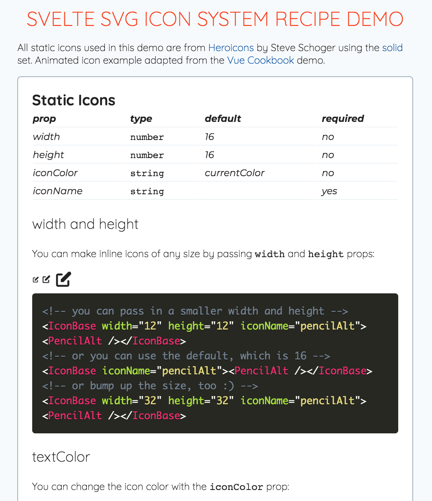

# Svelte Recipes - SVG Icon System

A demo for the [Svelte Recipes](https://github.com/svelte-society/recipes-mvp/) walkthrough on setting up a simple SVG icon system using `slots`. (https://github.com/svelte-society/recipes-mvp/blob/master/walkthroughs.md)

[Demo](https://svelte-recipes-svg-icons-demo.netlify.app) 
